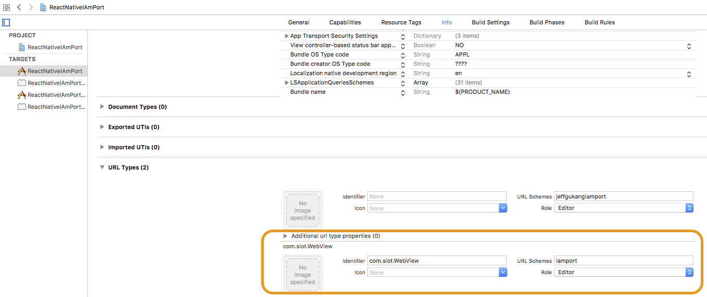

# react-native-iamport


리엑트 네이티브 아임포트 공식 라이브러리 [iamport](https://github.com/iamport/iamport-react-native)가 나옴에 따라 본 레파지토리는 더 이상 업데이트 되지 않습니다. 
그 동안 사용해주셔서 감사합니다.

공식 주소: https://github.com/iamport/iamport-react-native


리액트 네이티브용 아임포트 모듈입니다. 필요에 의해 나이스페이와 카카오페이, 페이코만 구현하였습니다. 안드로이드에서의 리액트네이티브 웹뷰는 이벤트 핸들링이 뜻대로 되질 않아 직접 안드로이드로 모듈 구현하였습니다. 필요에 따라 더 구현을 해서 사용하실 분들을 위해 공개합니다.

# Installation

```
npm install --save react-native-iamport
react-native link react-native-iamport
```

# IOS 설정

### XCode 프로젝트의 Target에서 info 에 scheme 정보 추가

app_scheme는 IAmPort 모듈에 정의할 것을 입력한다. (아래 Example 참조)




### Info.plist 파일에 NSAppTransportSecurity 내용 추가

```
<key>NSAppTransportSecurity</key>
<!--See http://ste.vn/2015/06/10/configuring-app-transport-security-ios-9-osx-10-11/ -->
<dict>
	<key>NSExceptionDomains</key>
	<dict>
		<key>localhost</key>
		<dict>
			<key>NSExceptionAllowsInsecureHTTPLoads</key>
			<true/>
		</dict>
	</dict>
	<key>NSAllowsArbitraryLoads</key> <-- 추가
	<true/> <-- 추가
	<key>NSAllowsArbitraryLoadsInWebContent</key> <-- 추가
	<true/> <-- 추가
</dict>
```

### Info.plist 파일에 LSApplicationQueriesSchemes 내용 추가
```
<key>LSApplicationQueriesSchemes</key>
<array>
	<string>kakao0123456789abcdefghijklmn</string>
	<string>kakaokompassauth</string>
	<string>storykompassauth</string>
	<string>kakaolink</string>
	<string>kakaotalk</string>
	<string>kakaostory</string>
	<string>storylink</string>
	<string>payco</string>
	<string>kftc-bankpay</string>
	<string>ispmobile</string>
	<string>itms-apps</string>
	<string>hdcardappcardansimclick</string>
	<string>smhyundaiansimclick</string>
	<string>shinhan-sr-ansimclick</string>
	<string>smshinhanansimclick</string>
	<string>kb-acp</string>
	<string>mpocket.online.ansimclick</string>
	<string>ansimclickscard</string>
	<string>ansimclickipcollect</string>
	<string>vguardstart</string>
	<string>samsungpay</string>
	<string>scardcertiapp</string>
	<string>lottesmartpay</string>
	<string>lotteappcard</string>
	<string>cloudpay</string>
	<string>nhappvardansimclick</string>
	<string>nonghyupcardansimclick</string>
	<string>citispay</string>
	<string>citicardappkr</string>
	<string>citimobileapp</string>
	<string>itmss</string>
</array>
```

# 안드로이드 설정

### AndroidManifest.xml 추가

리엑트 네이티브 안드로이드 환경에서는 manifest상에 redirect를 위한 **appscheme을 등록하지 않습니다.**

```
<activity
  android:name=".MainActivity"
  android:label="@string/app_name"
  android:configChanges="keyboard|keyboardHidden|orientation|screenSize"
  android:launchMode="singleTask"> <-- singletask launchMode 추가
  <intent-filter>
	  <action android:name="android.intent.action.MAIN" />
	  <category android:name="android.intent.category.LAUNCHER" />
  </intent-filter>
  <intent-filter>  <-- 인텐트 필터 추가
	  <action android:name="android.intent.action.VIEW" />
	  <category android:name="android.intent.category.DEFAULT" />
	  <category android:name="android.intent.category.BROWSABLE" />
	  <data android:scheme="" /> <-- iOS와 달리 파라미터에 사용된 appscheme을 등록하지 않습니다.
  </intent-filter>
</activity>
```

# Example

```javascript
import React, {Component} from 'react';

import { View } from 'react-native';

import IAmPort from 'react-native-iamport';

export default class Payment extends Component {

  _onPaymentResultReceive(response) {

    if (response.result == "success") {

	  //성공시의 로직
    } else {

      //실패시의 로직
    }
  }

  render() {

    return (
		<IAmPort onPaymentResultReceive={this._onPaymentResultReceive} params={{
	      code: "iamport",
		  pg: "nice",
	      pay_method: "card",
	      app_scheme: "yourscheme",
	      name: "주문명:결제테스트",
	      amount: 1000,
	      buyer_email: "iamport@siot.do",
	      buyer_name: "구매자",
	      buyer_tel: "010-1234-5678",
	      buyer_addr: "서울특별시 강남구 삼성동",
	      buyer_postcode: "123-456"
	    }}></IAmPort>
    )
  }
}
```
